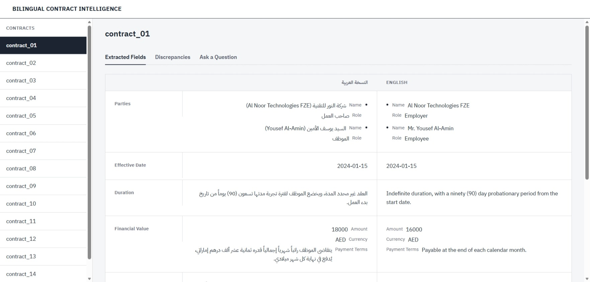
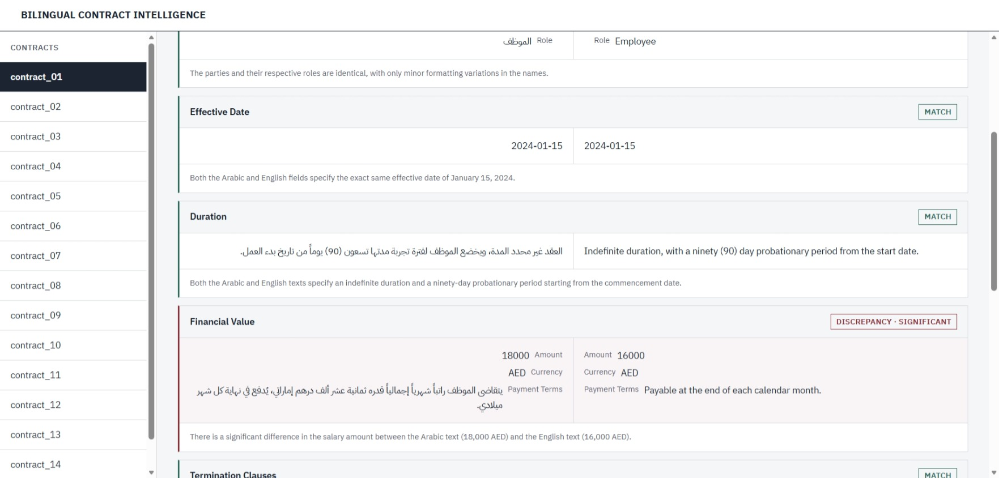
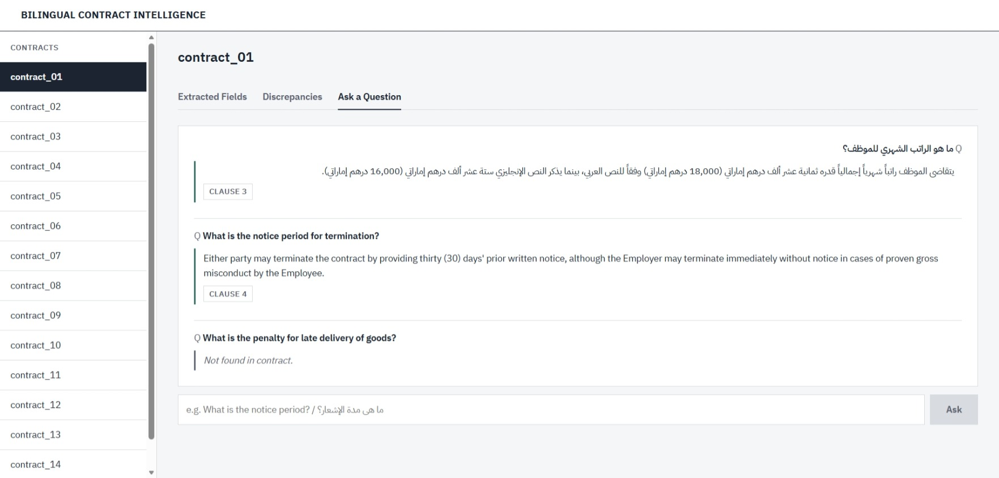
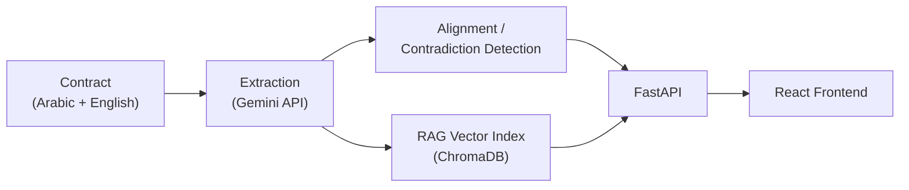

# Bilingual Contract Intelligence System


**An AI system that extracts, cross-checks, and answers questions about bilingual Arabic/English contracts — catching the discrepancies between language versions that nobody currently checks.**

---

## The Problem

Bilingual (Arabic/English) contracts are the norm across the Arabic-speaking region, and nearly all of them include a "language precedence" clause — a sentence stating that if the two versions ever disagree, one language (usually Arabic) legally prevails. In practice, almost nobody actually reads both versions side by side to check whether they *do* agree. Existing contract-analysis tools (Ironclad, Luminance, and similar) are built English-first and have no real answer for this — they're not designed to compare two language versions of the same document at all, let alone flag when a translated payment amount, notice period, or termination condition quietly drifted from the original.

## What This Does

- **Structured extraction** — pulls parties, effective date, duration, financial value, termination clauses, penalty clauses, governing law, and the language-precedence clause from each language section *independently*, via the Gemini API, so each language's extraction reflects only what that section actually says.
- **Cross-lingual discrepancy detection** — aligns every extracted field between the Arabic and English versions and judges whether they express the same substantive meaning or a real discrepancy, rating each one's severity (`none` / `minor` / `significant`) rather than just diffing text.
- **RAG Q&A with citations and hallucination guardrails** — answers questions about a contract in whichever language they're asked (cross-lingual retrieval, so an Arabic question can be answered from an English clause or vice versa), cites the exact clause number(s) used, and is instructed to respond **"Not found in contract"** — not a guess — when the contract doesn't actually address the question.

## Screenshots

**Extracted fields, side by side.** Arabic (right-to-left) and English (left-to-right) extractions rendered in parallel for every schema field — here already visibly disagreeing on the salary amount before any discrepancy check has even run.



**Discrepancy detection.** Every field gets a match/discrepancy verdict; a confirmed significant discrepancy (financial value: 18,000 vs 16,000 AED) is flagged with a seal-red left border and highlighted value, while agreeing fields carry a verified-teal `MATCH` badge.



**Cross-lingual Q&A.** Questions are answered in whichever language they were asked, with the specific clause number(s) cited — and a question the contract genuinely doesn't address gets an explicit "Not found in contract," not an invented answer.



## Architecture



**Tech stack:** Python (extraction, alignment, RAG, eval) · Gemini API (structured extraction, equivalence judgment, embeddings, Q&A) · ChromaDB (cross-lingual vector store) · FastAPI (backend, with in-process caching and rate-limit handling) · React + Vite (frontend).

## Key Results

| Metric | Result |
|---|---|
| Extraction accuracy — Arabic | 97.1% |
| Extraction accuracy — English | 98.3% |
| Cache speedup on repeated calls | ~800x (24.7s → 0.03s) |
| False-positive discrepancies after alignment tuning | 0 |
| Contracts processed with zero pipeline failures | 15 / 15 |

Full field-by-field numbers are in [`eval/extraction_eval_report.json`](eval/extraction_eval_report.json), produced by [`eval/extraction_eval.py`](eval/extraction_eval.py).

## Interesting Technical Decisions

### The contract_06 false positive: what it looked like

contract_06 is a synthetic NDA deliberately seeded with **no** discrepancy between its Arabic and English versions. Early in development, the alignment pipeline disagreed — it reported two "significant" discrepancies on a contract that should have had zero. One was on the penalty clause: the Arabic-side extraction described the liquidated-damages trigger as a breach of *"confidentiality obligations,"* while the English-side extraction said just *"obligations."* The other was on governing law: the Arabic-side extraction added *"exclusive"* jurisdiction; the English side didn't. Diagnosing it meant going back to the raw contract text — and neither qualifier was actually there. The source Arabic clause just says "its obligations" (التزاماته) and "has jurisdiction" (تختص), with no equivalent of "confidentiality" or "exclusive." The extractor had quietly embellished the Arabic paraphrase with contextually plausible detail that wasn't in the source, and the aligner was — correctly — flagging that the two extracted values now disagreed.

### Why temperature=0 alone wasn't enough

The first fix attempted was setting `temperature=0` on every Gemini call, on the assumption that eliminating sampling randomness would make the Arabic and English extractions of the same underlying fact converge. It changed nothing. The reason is that `temperature` only controls randomness *across repeated calls with the same input* — it does nothing about a *systematic* tendency the model has on a *specific* input, which is what was actually happening here: the model reliably added "confidentiality" every time it read that particular Arabic clause, deterministically, temperature or not. The real fix had to happen at the prompt level, not the sampling level.

### The fix: a literalness rule for the extractor, and concrete examples for the aligner

Two changes closed the gap. First, the extraction prompt gained an explicit fidelity instruction: stay strictly literal when paraphrasing free-text fields, and never add descriptive qualifiers, scope words, or interpretive detail not explicitly stated in the source — with the exact "exclusive jurisdiction" and "confidentiality obligations" failure modes named directly in the prompt as things *not* to do. Second, the aligner's equivalence-judgment prompt got concrete paired examples of the match/discrepancy boundary it was expected to draw — e.g. *"confidential and exclusive information"* vs *"confidential information"* → match, if both clearly refer to the same scope; *"30 days"* vs *"45 days"* → discrepancy. Without those examples, the model's sense of where "different wording, same meaning" ends and "different substance" begins was inconsistent. Together, these took contract_06 from two false "significant" discrepancies to zero, while contract_01 (which *does* have a seeded salary discrepancy) continued to correctly report exactly one.

### The tradeoff: currency normalization

The literalness fix then surfaced a side effect: the extractor started returning currency exactly as written in the source — e.g. `"درهم إماراتي"` for an Arabic clause — instead of normalizing it to an ISO 4217 code, because "normalize to a code" is itself a form of interpretive rewriting, and the new fidelity rule was actively discouraging exactly that kind of rewriting. Relaxing the fidelity rule again to fix this would have reopened the false-positive risk it was just closed. Instead, a small deterministic post-processing step — `normalize_currency()` in `extraction/extractor.py` — maps around 30 known Arabic and English currency name variants to their ISO codes *after* extraction, and leaves anything it doesn't recognize untouched rather than guessing. `financial_value.currency` accuracy went to 100% on both languages without touching the LLM prompt again, and the extractor's literalness elsewhere stayed intact.

## Known Limitations

- **Minor list-item-splitting inconsistencies in extraction (~2–3% of fields).** The model occasionally splits one combined clause ("terminates on X, or by Y") into two list items instead of one, or the reverse, depending on phrasing. The underlying content is still fully captured in these cases — this shows up as a small number of "incomplete extraction" flags in the eval harness's count-based list check, not as missing information.
- **Free-tier Gemini rate limits** (15 requests/minute on the flash-lite tier used here) are mitigated with in-process response caching (extraction and discrepancy results are cached per contract for the life of the server process, with a `force_refresh` escape hatch) and a 429 → friendly-retry-message path in the API and frontend — but a full 15-contract batch evaluation still has to pace itself with delays between calls.
- **Not yet tested on scanned/OCR'd contracts.** The pipeline assumes clean, machine-readable text input (`data/raw_contracts/*.txt`). A scanned PDF would need an OCR step first — `extraction/parser.py` is reserved for this in the architecture but not yet implemented.

## Setup & Running Locally

1. **Clone the repo** and `cd` into it.
2. **Install Python dependencies:**
   ```bash
   pip install -r requirements.txt
   ```
3. **Get a free Gemini API key** from [Google AI Studio](https://aistudio.google.com/app/apikey), then create a `.env` file in the project root:
   ```
   GEMINI_API_KEY=your_key_here
   ```
4. **Run the backend:**
   ```bash
   uvicorn api.main:app --reload
   # if uvicorn isn't on your PATH:
   python -m uvicorn api.main:app --reload
   ```
5. **Run the frontend** (in a second terminal):
   ```bash
   cd frontend
   npm install
   npm run dev
   ```
6. **Open [http://localhost:5173](http://localhost:5173)** and pick a contract from the sidebar.

To reproduce the evaluation numbers above:
```bash
python eval/extraction_eval.py
```

## Project Structure

```
contract-intelligence/
├── data/
│   ├── raw_contracts/          # 15 synthetic bilingual contracts (.txt)
│   ├── schema.json             # Definition of fields to extract
│   └── ground_truth/           # Manually labeled answers + known discrepancies, for evaluation
│
├── extraction/
│   └── extractor.py            # Structured extraction via Gemini API (JSON schema, currency normalization)
│
├── alignment/
│   └── aligner.py               # Cross-lingual field alignment + LLM-based equivalence/discrepancy judgment
│
├── rag/
│   ├── vector_store.py         # Clause-level ChromaDB index (Gemini embeddings)
│   ├── retriever.py             # Cross-lingual clause retrieval
│   └── qa_engine.py             # Question answering + "not found" guardrails
│
├── eval/
│   ├── extraction_eval.py      # Accuracy evaluation across all 15 contracts
│   └── extraction_eval_report.json
│
├── api/
│   ├── main.py                 # FastAPI app entrypoint
│   ├── cache.py                 # In-process response cache
│   ├── errors.py                 # Gemini error → HTTP translation (429 rate-limit handling)
│   ├── schemas.py               # Pydantic request/response models
│   └── routers/                 # extraction, alignment, qa endpoints
│
├── frontend/                   # React + Vite app (contract list, extraction/discrepancy/QA views)
│
├── docs/
│   └── screenshots/             # README screenshots
│
└── CLAUDE.md                   # Project instructions / architecture notes
```

## Data Disclaimer

All 15 contracts in `data/raw_contracts/` are **AI-generated synthetic data**, created specifically for testing this system. Every company name, person, date, and monetary amount is fictional. None of these are real contracts, and no real entities are represented — this is explicitly noted in each contract file and in `data/ground_truth/`.
